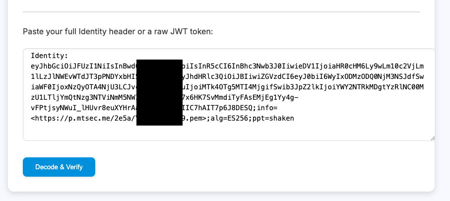
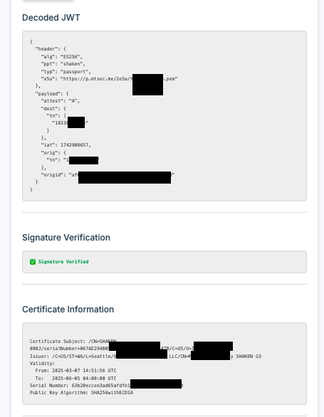
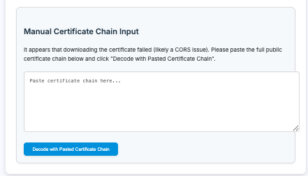

# STIR/SHAKEN Identity Header Decoder

## Description

This tool is a web-based utility designed to decode and verify the STIR/SHAKEN Identity header found in SIP (Session Initiation Protocol) SDP (Session Description Protocol) messages. STIR/SHAKEN is a set of standards aimed at combating caller ID spoofing in telecommunications.  This tool allows you to inspect the contents of the Identity header, verify its cryptographic signature, and examine the certificate chain used to sign it.

## Features

* **Identity Header Decoding:** Parses the Identity header or raw JWT (JSON Web Token) to extract the header and payload.
* **Signature Verification:** Verifies the cryptographic signature of the JWT to ensure the authenticity of the Identity header.
* **Certificate Information:** Displays detailed information about the certificate used to sign the Identity header, including the subject, issuer, validity period, and serial number.
* **Certificate Chain Handling:**
    * Attempts to automatically download the certificate chain from the URL provided in the JWT header (x5u).
    * Provides an option to manually paste the certificate chain if automatic download fails (e.g., due to CORS issues).
* **Debug Output:** Displays the full certificate chain and parsed certificate information for detailed analysis.
* **User-Friendly Interface:** Simple and intuitive web interface.

Got an SDP handy with an Identity: header ?  Try it live @ 

## How to Use

1.  **Obtain the HTML:** Download the `stirshaken_decoder.html` file.
2.  **Open in a Browser:** Open the `stirshaken_decoder.html` file in your web browser.
3.  **Paste the Identity Header or JWT:** In the provided text area, paste either the complete Identity header from the SIP SDP message or the raw JWT token.

    

4.  **Decode and Verify:** Click the "Decode & Verify" button.
5.  **View the Results:** The tool will display the following information:
    * Decoded JWT header and payload.
    * Signature verification status (valid or invalid).
      
     

    * Certificate information.
    * Full debug output.
6.  **Manual Certificate Chain Input (If Necessary):** If the certificate chain cannot be downloaded automatically, the tool will display a "Manual Certificate Chain Input" section.  In this case:

     
   
    * Paste the full certificate chain (in PEM format) into the provided text area.
    * Click the "Decode with Pasted Certificate Chain" button.

## Prerequisites

* A web browser that supports JavaScript.
* (Optional) The certificate chain in PEM format, if automatic download fails.

## Troubleshooting

* **CORS Errors:** If you encounter errors related to Cross-Origin Resource Sharing (CORS) when the tool attempts to download the certificate chain, you will need to manually paste the certificate chain.
* **Invalid JWT:** If the input is not a valid JWT, the tool will display an error message.
* **Signature Verification Failed:** If the signature verification fails, it indicates that the Identity header has been tampered with or is invalid.
* **Certificate Errors:** If there are issues with the certificate or certificate chain, the tool may display errors or incomplete information.
